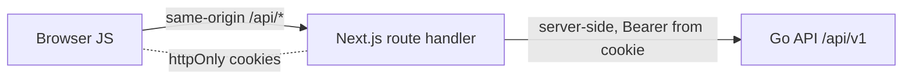

# Frontend — Backend-for-Frontend (BFF)

The browser never talks to the Go API directly. It only reaches the Next.js app
at its own origin; every backend call is proxied **server-side** by a Next.js
route handler under `frontend/src/app/api/`.

## Tokens live in httpOnly cookies

Access/refresh JWTs are stored in httpOnly cookies (`dgov_access`,
`dgov_refresh`; an RP-initiated logout URL in `dgov_sso_logout`) defined in
`lib/cookies.ts`. Because they are httpOnly, XSS cannot exfiltrate them, and they
never reach client JavaScript. `lib/api.ts` and `lib/bff.ts` are both marked
`import 'server-only'`, so they cannot be bundled into client code.

## Token-safe proxying

Backend responses are never streamed verbatim to the browser. Two converters in
`lib/bff.ts` are the only sanctioned way to reply:

- **`toClientResponse(r)`** returns only `ok / status / message` (plus
  `fieldErrors` on failure) — no data at all.
- **`proxyResult(r)`** adds the non-secret `data` on success.

Both clamp the HTTP status to a 4xx/5xx range (out-of-range collapses to 502)
and never emit token fields.

The single server-side entry point to the Go API is `lib/api.ts`:
`const BASE = (process.env.BACKEND_URL ?? 'http://localhost:8080') + '/api/v1'`.
`backendFetch` unwraps the backend envelope into a uniform `ApiResult<T>`, forces
`cache: 'no-store'`, and forwards the incoming `x-forwarded-for` so the API's
per-IP rate limiter sees the real client IP.

## Double CSRF defense

Every mutating BFF route calls `checkOrigin` (`lib/bff.ts`) first, which enforces
two independent checks:

1. **Custom header** — the request must carry `x-dgov-csrf: 1`. A cross-site HTML
   form cannot set custom headers, and a cross-origin `fetch` that tries is
   blocked by CORS preflight — so the header's presence proves the request came
   from the app's own JS. This closes the `SameSite=Lax` top-level-navigation gap.
2. **Origin match** — if an `Origin` header is present it must equal
   `APP_ORIGIN`; otherwise 403.

The header is stamped in exactly one place on the browser side —
`lib/client.ts`. `sendJSON` / `postJSON` attach `x-dgov-csrf: 1` to every
POST/PUT/DELETE; `getJSON` is GET-only and throws on non-`ok`, making it a clean
TanStack Query `queryFn`. Dynamic-segment IDs are validated by
`checkUUID` / `checkIntID` before hitting the backend.

## TanStack Query data layer

The provider (`components/Providers.tsx`) holds one `QueryClient` with
`staleTime: 30_000`, `retry: 1`, `refetchOnWindowFocus: false`. Reads flow as
`getJSON` used as a `useQuery` `queryFn`, giving caching, request deduplication,
and post-mutation invalidation.

## Refresh rotates — the cookie-writability probe

Refresh is reactive: `authedFetch` attaches the Bearer access token and, on a
`401`, calls `tryRefresh` once, then retries. The critical caveat: the backend
`/auth/refresh` **rotates** tokens — the old refresh `jti` is consumed on use.

In an RSC render context, cookies cannot be written, so a rotation there would
burn a valid session without persisting the replacement. `tryRefresh` therefore
calls `canPersistSession()` first and **bails out entirely** if cookies aren't
writable, deferring the refresh to the next route-handler request. `getMe`
deliberately distinguishes 401/403 (session dead → clear + re-login) from
5xx/503 (backend down → keep session) to avoid redirect loops.

## Internationalization

Strings are centralized in `lib/i18n.ts` as `dict = { mn: {...}, en: {...} }`
with `DictKey = keyof dict['mn']`. The React binding is `lib/lang.tsx`:
`LangProvider` shares the language via context (default `mn`, synced from
`localStorage`), and `useT()` returns `{ lang, T, tRole, tPerm }`. Every key must
exist in both `mn` and `en`.
