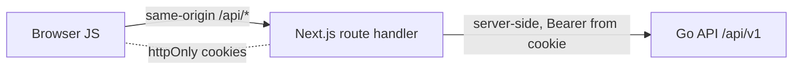

# Frontend — Backend-for-Frontend (BFF)

Хөтөч нь Go API-тай хэзээ ч шууд харьцдаггүй. Энэ нь зөвхөн Next.js апп-д
өөрийнх нь эх (origin) дээр хүрдэг; backend дуудалт бүр нь `frontend/src/app/api/`
доорх Next.js route handler-ээр **сервер талд** proxy хийгддэг.

## Token-ууд httpOnly cookie дотор амьдардаг

Access/refresh JWT-ууд нь `lib/cookies.ts` дотор тодорхойлогдсон httpOnly cookie
дотор (`dgov_access`, `dgov_refresh`; RP-эхлүүлсэн logout URL нь
`dgov_sso_logout` дотор) хадгалагддаг. Тэдгээр нь httpOnly учраас XSS тэдгээрийг
задруулж чадахгүй бөгөөд client JavaScript руу хэзээ ч хүрдэггүй. `lib/api.ts`
болон `lib/bff.ts` хоёул `import 'server-only'` гэж тэмдэглэгдсэн тул client код
руу bundle хийгдэж чадахгүй.

## Token-аюулгүй proxy

Backend хариултууд хэзээ ч хөтөч рүү үг үсэгчлэн (verbatim) stream хийгддэггүй.
`lib/bff.ts` доторх хоёр хөрвүүлэгч нь хариулах зөвшөөрөгдсөн цорын ганц арга юм:

- **`toClientResponse(r)`** нь зөвхөн `ok / status / message`-г буцаана (амжилтгүй
  үед `fieldErrors` нэмнэ) — огт `data` байхгүй.
- **`proxyResult(r)`** нь амжилттай үед нууц бус `data`-г нэмнэ.

Хоёул HTTP статусыг 4xx/5xx муж руу хязгаарладаг (мужаас гарвал 502 болж нурна)
бөгөөд хэзээ ч token талбар гаргадаггүй.

Go API руу орох сервер талын цорын ганц entry point нь `lib/api.ts`:
`const BASE = (process.env.BACKEND_URL ?? 'http://localhost:8080') + '/api/v1'`.
`backendFetch` нь backend дугтуйг нэгдсэн `ApiResult<T>` руу задалж, `cache:
'no-store'`-ыг албадаж, ирж буй `x-forwarded-for`-ыг дамжуулдаг тул API-ийн
per-IP rate limiter бодит client IP-г хардаг.

## Давхар CSRF хамгаалалт

Мутаци хийдэг BFF route бүр эхлээд `checkOrigin`-ыг (`lib/bff.ts`) дуудах бөгөөд
энэ нь хоёр бие даасан шалгалтыг хэрэгжүүлдэг:

1. **Custom header** — хүсэлт нь `x-dgov-csrf: 1`-ыг заавал агуулах ёстой.
   Cross-site HTML form нь custom header тохируулж чадахгүй бөгөөд оролдсон
   cross-origin `fetch` нь CORS preflight-ээр блоклогддог — тул header байгаа нь
   хүсэлт апп-ын өөрийн JS-ээс ирснийг батална. Энэ нь `SameSite=Lax`
   top-level-navigation-ийн цоорхойг хаадаг.
2. **Origin match** — `Origin` header байгаа бол `APP_ORIGIN`-тэй тэнцүү байх
   ёстой; эс бөгөөс 403.

Header нь хөтчийн талд яг нэг газарт тамгалагддаг — `lib/client.ts`. `sendJSON` /
`postJSON` нь POST/PUT/DELETE бүрт `x-dgov-csrf: 1`-ыг хавсаргана; `getJSON` нь
зөвхөн GET бөгөөд `ok` биш үед throw хийдэг тул цэвэрхэн TanStack Query `queryFn`
болдог. Dynamic-segment ID-ууд нь backend-т хүрэхээс өмнө
`checkUUID` / `checkIntID`-ээр баталгаажуулагдана.

## TanStack Query өгөгдлийн давхарга

Provider (`components/Providers.tsx`) нь `staleTime: 30_000`, `retry: 1`,
`refetchOnWindowFocus: false`-той нэг `QueryClient`-ыг агуулна. Уншилтууд нь
`useQuery`-ийн `queryFn` болгон ашиглагдсан `getJSON` байдлаар урсаж, кэшлэлт,
хүсэлтийн давхардал арилгах болон мутацийн дараах invalidation-ыг өгдөг.

## Refresh нь rotate хийдэг — cookie-бичигдэх боломжийн шалгуур { #refresh-rotates-the-cookie-writability-probe }

Refresh нь reactive: `authedFetch` нь Bearer access token-ыг хавсаргаж, `401`
дээр `tryRefresh`-ыг нэг удаа дуудаад дараа нь дахин оролддог. Гол анхаарах
зүйл: backend `/auth/refresh` нь token-уудыг **rotate** хийдэг — хуучин refresh
`jti` нь ашиглагдмагц устгагдана.

RSC render context дотор cookie-ыг бичиж болохгүй тул тэнд rotation хийвэл
орлуулагчийг хадгалалгүйгээр хүчинтэй session-ыг шатаана. Тиймээс `tryRefresh` нь
эхлээд `canPersistSession()`-ыг дуудаж, cookie бичигдэх боломжгүй бол **бүрмөсөн
гарах** ба refresh-ыг дараагийн route-handler хүсэлт хүртэл хойшлуулна. `getMe`
нь redirect loop-оос зайлсхийхийн тулд 401/403 (session үхсэн → цэвэрлэж дахин
нэвтрэх) болон 5xx/503 (backend унасан → session-ыг хадгалах)-ыг зориудаар
ялгадаг.

## Олон хэлний дэмжлэг (Internationalization)

String-үүд нь `lib/i18n.ts` дотор `dict = { mn: {...}, en: {...} }` байдлаар
`DictKey = keyof dict['mn']`-той төвлөрүүлэгдсэн. React холболт нь `lib/lang.tsx`:
`LangProvider` нь хэлийг context-оор хуваалцдаг (default `mn`, `localStorage`-оос
sync хийгдсэн), `useT()` нь `{ lang, T, tRole, tPerm }`-ыг буцаана. Түлхүүр бүр
`mn` болон `en` хоёуланд заавал байх ёстой.
