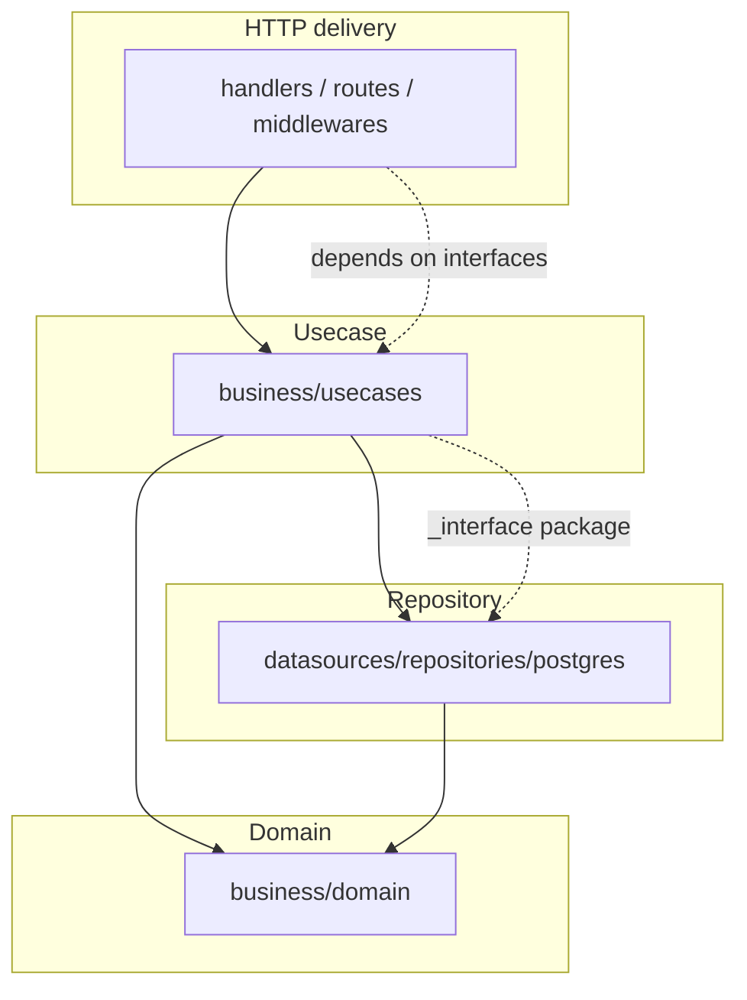

# Architecture

The backend is a Go module following **Clean Architecture** — a four-ring design
where dependencies point inward only. It pairs with a Next.js
Backend-for-Frontend and uses PostgreSQL (with Row-Level Security) and Redis.

## The rings

| Ring | Package root | Depends on | Never imports |
|------|--------------|-----------|---------------|
| HTTP (delivery) | `internal/http/` | usecase interfaces | — |
| Usecase | `internal/business/usecases/` | `repositories/interface` (`_interface`) + domain | postgres adapters, chi/net-http |
| Repository | `internal/datasources/repositories/postgres/` | domain, `records`, `rls` | — |
| Domain | `internal/business/domain/` | stdlib + `bcrypt` only | anything internal |

The dependency rule is verified structurally: `internal/business/**` and
`internal/datasources/repositories/**` import no chi/net-http package, so the
delivery framework is swappable. A per-route authorization-matrix test
(`internal/http/routes/routes_authz_matrix_test.go`) guards the auth wiring.

## Read the details

- **[Clean Architecture](clean-architecture.md)** — the dependency rule, the
  `_interface` package, and the one sanctioned exception.
- **[Backend Layers](backend-layers.md)** — directory map, manual DI wiring, and
  the pgx data layer.
- **[Data Model & RLS](data-model.md)** — the tables by domain and how
  Row-Level Security isolates per-user rows.
- **[Frontend BFF](frontend-bff.md)** — the browser → same-origin proxy model,
  CSRF defense, and TanStack Query.
