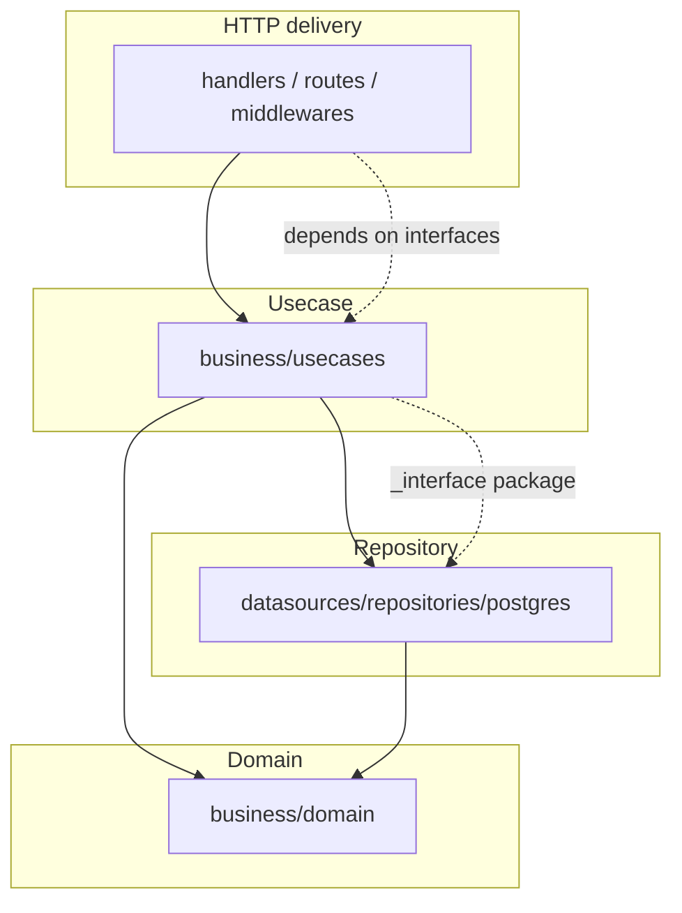

# Architecture

Backend нь **Clean Architecture**-ыг дагадаг Go модуль юм — хамаарал зөвхөн
дотогшоо чиглэсэн дөрвөн цагирагт (four-ring) дизайн. Энэ нь Next.js
Backend-for-Frontend-тэй хослож, PostgreSQL (Row-Level Security-тэй) болон
Redis-ийг ашигладаг.

## Цагиргууд (The rings)

| Цагираг | Package root | Хамаардаг | Хэзээ ч import хийхгүй |
|------|--------------|-----------|---------------|
| HTTP (delivery) | `internal/http/` | usecase interface-үүд | — |
| Usecase | `internal/business/usecases/` | `repositories/interface` (`_interface`) + domain | postgres adapter-ууд, chi/net-http |
| Repository | `internal/datasources/repositories/postgres/` | domain, `records`, `rls` | — |
| Domain | `internal/business/domain/` | зөвхөн stdlib + `bcrypt` | internal доторх юу ч |

Хамаарлын дүрэм нь бүтцийн хувьд баталгаажсан: `internal/business/**` болон
`internal/datasources/repositories/**` нь chi/net-http package-ийг огт import
хийдэггүй тул delivery framework нь солигдох боломжтой. Route бүрийн эрх олголтын
матрицын тест (`internal/http/routes/routes_authz_matrix_test.go`) нь auth
холболтыг хамгаална.

## Дэлгэрэнгүйг унших

- **[Clean Architecture](clean-architecture.md)** — хамаарлын дүрэм,
  `_interface` package болон зөвшөөрөгдсөн ганц үл хамаарах зүйл.
- **[Backend Layers](backend-layers.md)** — директорын зураглал, гар аргаар хийсэн
  DI холболт болон pgx өгөгдлийн давхарга.
- **[Data Model & RLS](data-model.md)** — домэйнээр ангилсан хүснэгтүүд болон
  Row-Level Security хэрхэн хэрэглэгч тус бүрийн мөрийг тусгаарлах нь.
- **[Frontend BFF](frontend-bff.md)** — хөтөч → ижил-эх proxy загвар, CSRF
  хамгаалалт болон TanStack Query.
