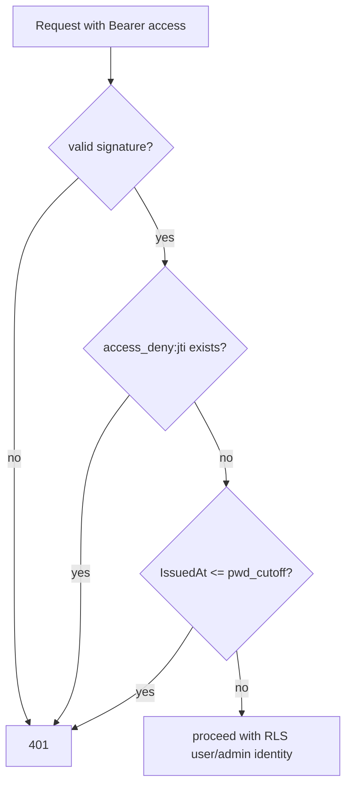

# Sessions & JWT

## Tokens

`pkg/jwt/jwt.go`. `GenerateTokenPair(userID, isAdmin, roleID, email)` signs:

- an **access** JWT — TTL `JWT_EXPIRED` hours (validated 1–24), and
- a **refresh** JWT — TTL `JWT_REFRESH_EXPIRED` days (validated 1–365, default 7).

Each carries a unique `jti`. Signing is HMAC with `WithValidMethods` to block
alg-confusion attacks.

## Where tokens are stored

**Client side (BFF model).** Tokens live in **httpOnly cookies**
(`dgov_access`, `dgov_refresh`) and never reach browser JS. Options: `httpOnly`,
`sameSite=lax`, `secure` (default true in production). Access cookie max-age 5 h,
refresh 7 days. See [Frontend BFF](../architecture/frontend-bff.md).

**Server side (revocation state).** Redis. The refresh `jti` is stored under
`refresh:<jti>` with the token's remaining TTL — **presence = valid, absence =
revoked**.

## Rotation — `POST /auth/refresh`

Refresh is **single-use**:

1. `ParseRefreshToken` validates signature/expiry.
2. **`GetDel` on `refresh:<jti>`** atomically reads-and-deletes the jti. This
   closes the replay/TOCTOU window — two concurrent requests with the same token
   race, only one gets a non-empty value, the other gets `revoked`.
3. Re-load the user by the stable `UserID` (not email — eID users have `email =
   NULL`), rejecting inactive accounts.
4. Enforce a password-rotation cutoff: tokens issued at/before
   `user.TokensRevokedBefore()` are rejected.
5. Mint a fresh pair and store the new jti. The old jti was already deleted, so
   this is a true rotation.

The frontend mirrors this: it only refreshes in cookie-writable contexts,
probing writability first because refresh rotates the token. See
[the BFF refresh caveat](../architecture/frontend-bff.md#refresh-rotates-the-cookie-writability-probe).

## Logout — revoking both tokens — `POST /auth/logout`

1. Parse the refresh token and **`Del` `refresh:<jti>`** — the primary,
   mandatory revocation.
2. `denyAccessToken` adds the access token's jti to a **deny-list**
   `access_deny:<jti>` with a TTL equal to the token's remaining lifetime.
   Best-effort — an unparseable/expired access token never fails logout.

## Middleware enforcement

On every authenticated request, `middleware_auth.go`:

- parses the Bearer access token;
- checks Redis — if `access_deny:<jti>` exists → **401** (immediate logout
  enforcement);
- compares the token's `IssuedAt` against `pwd_cutoff:<userID>` for
  password-rotation revocation.

