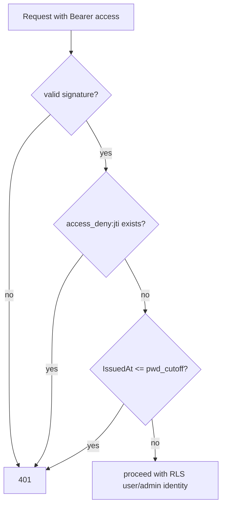

# Sessions & JWT

## Token-ууд

`pkg/jwt/jwt.go`. `GenerateTokenPair(userID, isAdmin, roleID, email)` нь дараахыг
гарын үсэг зурдаг:

- **access** JWT — TTL нь `JWT_EXPIRED` цаг (1–24-ийн хооронд шалгагдана), болон
- **refresh** JWT — TTL нь `JWT_REFRESH_EXPIRED` хоног (1–365-ийн хооронд
  шалгагдана, өгөгдмөл нь 7).

Тус бүр өвөрмөц `jti` агуулна. Гарын үсэг зурах нь HMAC бөгөөд alg-confusion
халдлагаас сэргийлэхийн тулд `WithValidMethods` ашиглана.

## Token-ууд хаана хадгалагддаг

**Клиент тал (BFF загвар).** Token-ууд нь **httpOnly cookie**-д (`dgov_access`,
`dgov_refresh`) хадгалагдах ба браузерын JS хэзээ ч хүрэхгүй. Сонголтууд:
`httpOnly`, `sameSite=lax`, `secure` (production дээр өгөгдмөлөөр true). Access
cookie-ийн max-age 5 цаг, refresh 7 хоног. [Frontend
BFF](../architecture/frontend-bff.md)-г үзнэ үү.

**Сервер тал (хүчингүй болгох төлөв).** Redis. Refresh `jti`-г `refresh:<jti>`
дор token-ий үлдсэн TTL-тэй хамт хадгална — **байгаа = хүчинтэй, байхгүй =
хүчингүй болгосон**.

## Эргэлт (Rotation) — `POST /auth/refresh`

Refresh нь **нэг удаагийн**:

1. `ParseRefreshToken` нь гарын үсэг/дуусах хугацааг шалгана.
2. **`refresh:<jti>` дээр `GetDel`** нь jti-г атомаар уншиж-устгана. Энэ нь
   replay/TOCTOU цонхыг хаана — ижил token-той хоёр зэрэгцээ хүсэлт өрсөлдөж,
   зөвхөн нэг нь хоосон биш утга авах ба нөгөө нь `revoked` авна.
3. Тогтвортой `UserID`-ээр хэрэглэгчийг дахин ачаална (имэйлээр биш — eID
   хэрэглэгчид `email = NULL` байдаг), идэвхгүй акаунтыг татгалзана.
4. Нууц үг эргүүлэх зааг хязгаарыг мөрдүүлнэ: `user.TokensRevokedBefore()`-д
   эсвэл түүнээс өмнө олгогдсон token-уудыг татгалзана.
5. Шинэ хос олгож, шинэ jti-г хадгална. Хуучин jti аль хэдийн устсан тул энэ нь
   жинхэнэ эргэлт болно.

Frontend үүнийг тусгадаг: refresh нь token-г эргүүлдэг тул зөвхөн cookie бичих
боломжтой контекст дэх бичих боломжийг эхлээд шалгаж байж refresh хийдэг. [BFF-ийн
refresh анхааруулгыг](../architecture/frontend-bff.md#refresh-rotates-the-cookie-writability-probe)
үзнэ үү.

## Гарах — хоёр token-ыг хүчингүй болгох — `POST /auth/logout`

1. Refresh token-г задлан шинжилж, **`refresh:<jti>`-г `Del`** хийнэ — үндсэн,
   заавал хийх хүчингүй болголт.
2. `denyAccessToken` нь access token-ий jti-г token-ий үлдсэн хугацаатай тэнцэх
   TTL-тэй **хориглох жагсаалт** `access_deny:<jti>` дээр нэмнэ. Аль болох хийх
   зарчмаар — задлах боломжгүй/дууссан access token гарахад хэзээ ч
   амжилтгүй болгодоггүй.

## Middleware мөрдүүлэлт

Баталгаажсан хүсэлт бүр дээр `middleware_auth.go`:

- Bearer access token-г задлана;
- Redis-г шалгана — хэрэв `access_deny:<jti>` байвал → **401** (шууд гарах
  мөрдүүлэлт);
- нууц үг эргүүлэх хүчингүй болголтын хувьд token-ий `IssuedAt`-г
  `pwd_cutoff:<userID>`-тэй харьцуулна.

