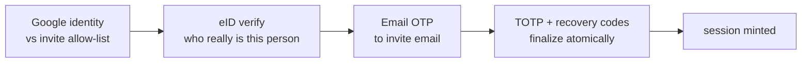

# Super Admin MFA

Super admins are provisioned through an **invite-gated wizard** and always
authenticate through a second MFA factor. Because a session is issued **only**
after the MFA step, every super-admin session is inherently MFA-verified — no
JWT claim change is needed.

- Routes: `route_superadmin_onboard.go`, mounted at `/api/v1/auth/superadmin`.
- Usecase: `business/usecases/superadmin_onboarding/`.
- All routes are **pre-login** (no `authMiddleware`); protection comes from the
  invite allow-list, the wizard's `onboard_token`, and the `mfa_token` +
  TOTP/recovery code. The whole group requires `INTEGRATION_ENC_KEY` (the
  usecase refuses to start without it).

## The onboarding wizard

Wizard state (`pendingSession`) lives in Redis under
`superadmin_onboard:<token>` (30 min TTL). `requireStep` enforces ordering so no
step can be skipped.



1. **Google (the only door).** `POST /onboard/google` exchanges the OAuth code,
   requires `email_verified`, and matches the email against
   **`superadmin_invites`**. No invite (or an already-accepted one) → `Forbidden`.
   The email used for the rest of the wizard is taken from the **invite row**,
   not from Google.
2. **eID.** `POST /onboard/eid/{start,start-id,poll}` — same QR / national-ID /
   25 s long-poll mechanics as [eID login](eid-login.md), but on `COMPLETE` it
   **does not create a user or mint a session** — it only captures the verified
   identity (`civil_id`, `national_id`, names, KYC) into the pending session.
3. **Email OTP.** `POST /onboard/email/{send,verify}` sends an OTP to the invite
   email (the client can't retarget it) and enforces a per-token attempt counter.
4. **TOTP + recovery codes (finalize).** `POST /onboard/totp/{init,verify}`.
   `TOTPVerify` finalizes atomically:
    - encrypts the TOTP secret with **AES-256-GCM** (`INTEGRATION_ENC_KEY`);
    - `users.UpsertSuperAdmin(user, account)` under **service RLS** creates the
      `users` row (`username = sa_<civil_id>`, `role_id = RoleSuperAdmin`, keyed
      by Google/email — `civil_id` is deliberately **not** stored on `users`);
    - generates recovery codes, storing **only SHA-256 hashes**; the plaintext is
      returned once and never again;
    - marks the invite accepted and mints a session.

## The `superadmin_accounts` satellite table

Super-admin sensitive credentials live in a **satellite** table, not on `users`:

```
superadmin_accounts(
  user_id uuid PK REFERENCES users(id) ON DELETE CASCADE,
  civil_id text, national_id text,      -- eID proof, NOT on users
  email_verified bool, mfa_enabled bool,
  totp_secret text,                     -- AES-GCM ciphertext
  invited_by text, onboarded_at, created_at, updated_at)
```

Keeping the super admin keyed by `google_sub`/`email` on `users` (with
`civil_id` only in the satellite) lets **one physical person be an eID-based
admin *and* a Google-based super admin** without colliding on the `civil_id`
partial-unique index. The table is RLS-forced and readable only under the
`service` or `admin` role. Writes go through `UpsertSuperAdmin` in one
transaction with the `users` row.

## The MFA second step at login

`requiresMFA(user)` returns `user.IsSuperAdmin()` — the code does not read a
`users.mfa_enabled` flag; if the satellite account is missing/broken the
challenge fails closed.

On a super admin's Google or eID login, the auth usecase mints **no session** —
it calls `startSuperadminMFA`, which stores a 5-minute `mfa_token` in Redis
(`superadmin_mfa:<token>` → `user_id`) and returns `{ MFARequired: true,
MFAToken }`. A Redis error aborts login rather than granting a session
(fail-closed).

**`POST /auth/superadmin/mfa`** completes the login:

- reads the `mfa_token` (fail-closed if missing/expired);
- enforces a per-token attempt counter (`MFAMaxAttempts`, default 5; the token is
  deleted on overflow);
- re-verifies the user is still a super admin with `mfa_enabled`;
- `verifyMFACode`: try **TOTP** against the decrypted secret, else consume a
  **recovery code** (SHA-256, single-use, atomic);
- on success deletes the token (single-use) and mints the session.

## RBAC context

Route gates live in `middleware_rbac.go`: `RequirePermission(resolver, perm)`
(403 on miss; legacy tokens with `RoleID=0` fall back to least-privilege
`RoleUser`), `RequireAdmin()`, and `RequireSuperAdmin()` — where even a plain
`RoleAdmin` cannot pass the super-admin gate. The 4-role model is
**superadmin → admin → manager → user**; super admin is the only role that can
manage admin accounts.
