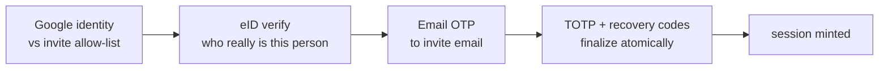

# Супер админ MFA

Супер админ хэрэглэгчид нь **урилгаар хамгаалагдсан визард**-аар бүртгэгддэг ба
үргэлж хоёр дахь MFA баталгаажуулалтаар нэвтэрдэг. Session нь MFA алхмын дараа
**зөвхөн** олгогддог тул супер-админ session бүр нь угаасаа MFA-баталгаажсан байдаг —
JWT claim-д өөрчлөлт хийх шаардлагагүй.

- Route-ууд: `route_superadmin_onboard.go`, `/api/v1/auth/superadmin` дор
  холбогдсон.
- Usecase: `business/usecases/superadmin_onboarding/`.
- Бүх route нь **нэвтрэхээс өмнөх** (`authMiddleware` байхгүй); хамгаалалт нь
  урилгын allow-list, визардын `onboard_token`, болон `mfa_token` +
  TOTP/сэргээх кодоос бүрдэнэ. Бүхэл бүлэг нь `INTEGRATION_ENC_KEY`-г шаарддаг
  (usecase нь энэ түлхүүргүйгээр эхлэхээс татгалздаг).

## Бүртгэлийн визард

Визардын төлөв (`pendingSession`) нь Redis дотор `superadmin_onboard:<token>` дор
(30 минутын TTL) байрлана. `requireStep` нь дарааллыг мөрдүүлдэг тул аль ч алхмыг
алгасах боломжгүй.



1. **Google (цорын ганц хаалга).** `POST /onboard/google` нь OAuth code-г
   солилцож, `email_verified`-г шаардаж, имэйлийг **`superadmin_invites`**-тэй
   тулгана. Урилга байхгүй (эсвэл аль хэдийн хүлээн авсан) бол → `Forbidden`.
   Визардын үлдсэн хэсэгт ашиглах имэйлийг Google-ээс биш, **урилгын мөрөөс**
   авна.
2. **eID.** `POST /onboard/eid/{start,start-id,poll}` — [eID
   нэвтрэлт](eid-login.md)-тэй ижил QR / иргэний үнэмлэхийн дугаар / 25 секундын
   long-poll механизмтай, гэхдээ `COMPLETE` үед **хэрэглэгч үүсгэдэггүй, session
   ч олгодоггүй** — зөвхөн баталгаажсан цахим танилтыг (`civil_id`,
   `national_id`, нэрс, KYC) хүлээгдэж буй session руу авдаг.
3. **Имэйл OTP.** `POST /onboard/email/{send,verify}` нь урилгын имэйл рүү OTP
   илгээнэ (клиент үүнийг өөр хаяг руу чиглүүлэх боломжгүй) ба token тус бүрийн
   оролдлогын тоолуурыг мөрдүүлнэ.
4. **TOTP + сэргээх кодууд (эцэслэх).** `POST /onboard/totp/{init,verify}`.
   `TOTPVerify` нь атомаар эцэслэдэг:
    - TOTP нууцыг **AES-256-GCM**-ээр (`INTEGRATION_ENC_KEY`) шифрлэнэ;
    - `users.UpsertSuperAdmin(user, account)` нь **service RLS** дор `users` мөр
      үүсгэнэ (`username = sa_<civil_id>`, `role_id = RoleSuperAdmin`,
      Google/имэйлээр түлхүүрлэсэн — `civil_id`-г зориудаар `users` дээр
      хадгалдаг**гүй**);
    - сэргээх кодуудыг үүсгэж, **зөвхөн SHA-256 хэшийг** хадгална; ил бичвэрийг
      нэг удаа буцаах ба дахин хэзээ ч биш;
    - урилгыг хүлээн авсан гэж тэмдэглэж, session олгоно.

## `superadmin_accounts` дагуул хүснэгт

Супер-админы эмзэг мэдээллийг `users` дээр биш, **дагуул (satellite)** хүснэгтэд
хадгалдаг:

```
superadmin_accounts(
  user_id uuid PK REFERENCES users(id) ON DELETE CASCADE,
  civil_id text, national_id text,      -- eID proof, NOT on users
  email_verified bool, mfa_enabled bool,
  totp_secret text,                     -- AES-GCM ciphertext
  invited_by text, onboarded_at, created_at, updated_at)
```

Супер админыг `users` дээр `google_sub`/`email`-ээр (харин `civil_id`-г зөвхөн
дагуул хүснэгтэд) түлхүүрлэснээр **нэг бодит хүн eID-д суурилсан админ *бас*
Google-д суурилсан супер админ** байх боломжтой болж, `civil_id`-ийн
хэсэгчилсэн-давхардалгүй индекс дээр мөргөлдөхгүй. Уг хүснэгт нь RLS-ээр
хүчлэгдсэн ба зөвхөн `service` эсвэл `admin` эрхээр л уншигдана. Бичих үйлдлүүд нь
`users` мөртэй нэг гүйлгээнд `UpsertSuperAdmin`-ээр дамжина.

## Нэвтрэх үеийн MFA хоёр дахь алхам

`requiresMFA(user)` нь `user.IsSuperAdmin()`-г буцаана — код нь
`users.mfa_enabled` тугийг уншдаггүй; хэрэв дагуул акаунт байхгүй/эвдэрсэн бол
сорилт нь fail-closed буюу хаагдсан байдлаар унана.

Супер админ Google эсвэл eID-ээр нэвтрэх үед auth usecase нь **session
олгодоггүй** — энэ нь `startSuperadminMFA`-г дуудна, энэ нь Redis дотор 5
минутын `mfa_token`-г (`superadmin_mfa:<token>` → `user_id`) хадгалж, `{
MFARequired: true, MFAToken }` буцаана. Redis-ийн алдаа гарвал session олгохын
оронд нэвтрэлтийг цуцлана (fail-closed).

**`POST /auth/superadmin/mfa`** нь нэвтрэлтийг гүйцээнэ:

- `mfa_token`-г уншина (байхгүй/дууссан бол fail-closed);
- token тус бүрийн оролдлогын тоолуурыг мөрдүүлнэ (`MFAMaxAttempts`, өгөгдмөл нь
  5; хэтэрвэл token устгагдана);
- хэрэглэгч одоо ч `mfa_enabled` бүхий супер админ хэвээр эсэхийг дахин шалгана;
- `verifyMFACode`: эхлээд шифрлэгдсэн нууцтай тулган **TOTP**-г оролдоно, эс бөгөөс
  **сэргээх код**-г хэрэглэнэ (SHA-256, нэг удаагийн, атом);
- амжилттай бол token-г устгаж (нэг удаагийн) session олгоно.

## RBAC контекст

Route-ийн хаалтууд нь `middleware_rbac.go` дотор байдаг:
`RequirePermission(resolver, perm)` (алдвал 403; `RoleID=0` бүхий хуучин token-ууд
хамгийн бага эрхтэй `RoleUser` руу буурна), `RequireAdmin()`, болон
`RequireSuperAdmin()` — энд энгийн `RoleAdmin` хүртэл супер-админ хаалтыг давж
чадахгүй. 4 үүргийн загвар нь **superadmin → admin → manager → user**; супер
админ бол админ акаунтуудыг удирдаж чадах цорын ганц үүрэг юм.
