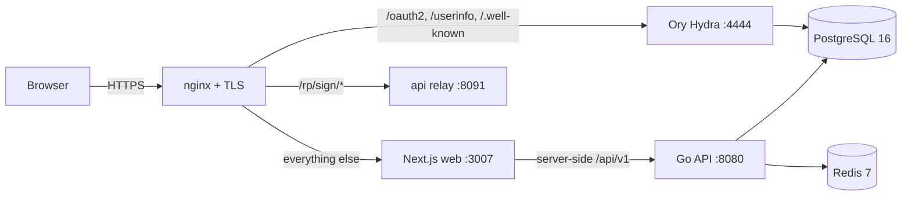

# Environments

## Runtime environments

The backend switches behaviour on the `ENVIRONMENT` config value
(`development` vs `production`, `backend/internal/config/config.go`). The
difference is not cosmetic — several security controls are gated on it.

| Control | development | production |
|---------|-------------|------------|
| HSTS header | omitted | `max-age=31536000; includeSubDomains` |
| DB `sslmode` | `disable` allowed | must be `verify-full` (or `verify-ca` internal) or boot fails |
| RLS boot guard | warns if DB role is superuser | **fails boot** if role is superuser / `BYPASSRLS` |
| `/metrics`, `/swagger/doc.json` | always open | bearer-gated; return **404** without a valid token |
| Document-Signer key | ephemeral self-signed allowed | must supply persistent PEM material or boot fails |

## Deployment topology

In production the platform runs behind **nginx** on the host, which terminates
TLS (Let's Encrypt) and fans out to three loopback upstreams:

- The Hydra **admin** port `:4445` is never proxied — it stays loopback-only.
- The Go API connects to Postgres as a least-privilege `NOSUPERUSER
  NOBYPASSRLS` role so RLS is actually enforced; the `migrate` job keeps the
  superuser for DDL / `CREATE EXTENSION`.
- `TRUSTED_PROXIES` must list nginx's address, or per-IP rate limiting and audit
  attribution collapse into a single bucket.

See [Deployment](../operations/deployment.md) for the full runbook.

## Hosted environment

| Environment | URL | Notes |
|-------------|-----|-------|
| Production | [sso.dgov.mn](https://sso.dgov.mn) | eID citizen login enabled |
| eID IdP | `https://eidmongolia.mn/v3` | Smart-ID-compatible v3 API (ACSP_V2) |
