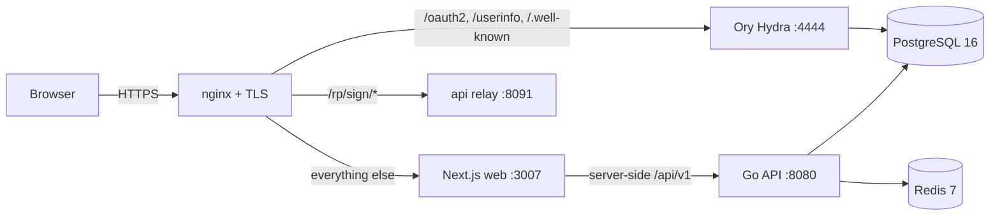

# Environments

## Ажиллах орчнууд

Backend нь `ENVIRONMENT` тохиргооны утгын дагуу зан төлвөө сольдог
(`development` эсэх `production`, `backend/internal/config/config.go`). Энэ ялгаа
нь зөвхөн гоо сайхны бус — хэд хэдэн хамгаалалтын хяналт үүн дээр тулгуурладаг.

| Хяналт | development | production |
|---------|-------------|------------|
| HSTS header | хасагдана | `max-age=31536000; includeSubDomains` |
| DB `sslmode` | `disable` зөвшөөрөгдөнө | `verify-full` (эсвэл дотоод `verify-ca`) байх ёстой, эсвэл boot амжилтгүй болно |
| RLS boot guard | DB роль superuser бол анхааруулна | роль superuser / `BYPASSRLS` бол **boot амжилтгүй болно** |
| `/metrics`, `/swagger/doc.json` | үргэлж нээлттэй | bearer-ээр хамгаалагдсан; хүчинтэй token-гүйгээр **404** буцаана |
| Document-Signer түлхүүр | түр зуурын self-signed зөвшөөрөгдөнө | тогтмол PEM материал өгөх ёстой, эсвэл boot амжилтгүй болно |

## Байрлуулалтын топологи

Продакшнд платформ нь хостын дээрх **nginx**-ийн ард ажилладаг бөгөөд энэ нь TLS
(Let's Encrypt)-ыг төгсгөж, гурван loopback upstream руу тараана:

- Hydra-ийн **admin** порт `:4445` хэзээ ч proxy-лагддаггүй — зөвхөн loopback хэвээр үлддэг.
- Go API нь Postgres руу хамгийн бага эрхтэй `NOSUPERUSER NOBYPASSRLS` роль
  болон холбогддог тул RLS үнэхээр хэрэгжинэ; `migrate` job нь DDL /
  `CREATE EXTENSION`-д зориулж superuser-ыг хадгална.
- `TRUSTED_PROXIES` нь nginx-ийн хаягийг жагсаах ёстой, эс тэгвээс per-IP rate
  limit болон audit-ийн эзэн тодорхойлолт нэг л bucket болж нурна.

Бүрэн ажиллагааны гарын авлагыг [Deployment](../operations/deployment.md)-ээс үз.

## Хостлогдсон орчин

| Орчин | URL | Тэмдэглэл |
|-------------|-----|-------|
| Production | [sso.dgov.mn](https://sso.dgov.mn) | eID иргэний нэвтрэлт идэвхжсэн |
| eID IdP | `https://eidmongolia.mn/v3` | Smart-ID-тэй нийцтэй v3 API (ACSP_V2) |
