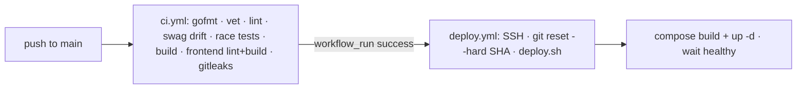

# Operations

How the platform is packaged, deployed, and observed.

- **[Deployment](deployment.md)** — the docker-compose stack, nginx + TLS, DB
  roles, migrations, and the update / rollback flow.
- **[Configuration](configuration.md)** — the env files and key variables.
- **[Observability](observability.md)** — tracing, metrics, and logs.

## CI/CD at a glance

`deploy.yml` triggers **after** CI completes (via `workflow_run`), so a red build
never ships and CI/deploy never run in parallel. It deploys only when the chained
run concluded `success` on `main`.

## CI gates (`.github/workflows/ci.yml`)

| Job | Checks |
|-----|--------|
| backend (Go 1.26) | `gofmt -l` empty · `go vet` · golangci-lint · **swagger drift** · `-race` tests · binary build |
| frontend (Node 20) | `npm ci` → `npm run lint` → `npm run build` (build includes typecheck) |
| secrets-scan | gitleaks `detect --no-git --redact` |

Docs-only pushes are ignored by `paths-ignore` (and therefore do not auto-deploy).
