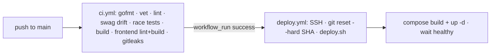

# Үйл ажиллагаа

Платформыг хэрхэн багцлах, байршуулах, ажиглах тухай.

- **[Байршуулалт](deployment.md)** — docker-compose stack, nginx + TLS, DB
  role-ууд, migration-ууд, шинэчлэх / буцаах урсгал.
- **[Тохиргоо](configuration.md)** — env файлууд болон гол хувьсагчид.
- **[Ажиглалт](observability.md)** — tracing, metrics, болон log-ууд.

## CI/CD-ийн товч тойм

`deploy.yml` нь CI дуусахын **дараа** (`workflow_run`-аар) ажилладаг тул алдаатай
build хэзээ ч нийлүүлэгддэггүй ба CI/deploy хэзээ ч зэрэг ажилладаггүй. Энэ нь
гинжлэгдсэн ажиллагаа `main` дээр `success` дүгнэгдсэн үед л байршуулна.

## CI хаалганууд (`.github/workflows/ci.yml`)

| Ажил | Шалгалтууд |
|-----|--------|
| backend (Go 1.26) | `gofmt -l` хоосон · `go vet` · golangci-lint · **swagger drift** · `-race` тестүүд · binary build |
| frontend (Node 20) | `npm ci` → `npm run lint` → `npm run build` (build нь typecheck-ийг агуулна) |
| secrets-scan | gitleaks `detect --no-git --redact` |

Зөвхөн docs-ийн push-ийг `paths-ignore` үл тоомсорлодог (тиймээс автоматаар
байршуулагддаггүй).
