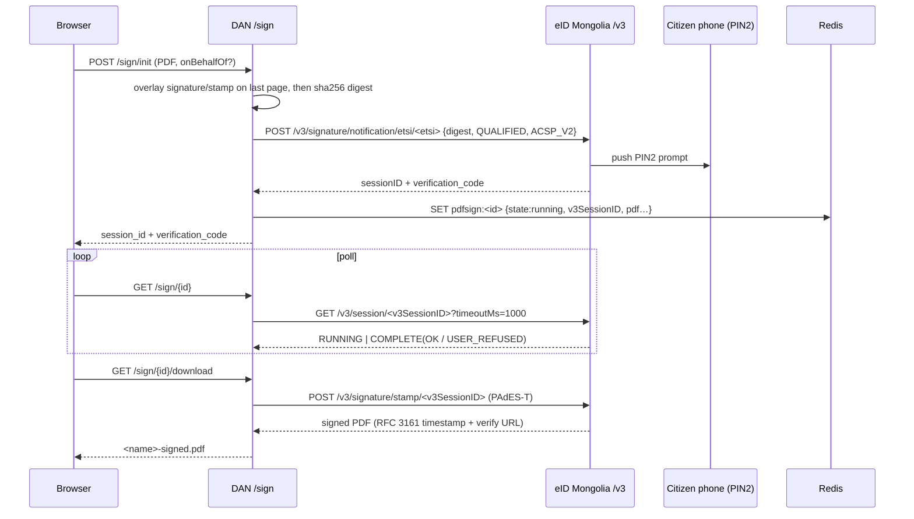

# Document Signing (PAdES)

Server-side PDF signing through **eID Mongolia's `/v3` API**. Implemented in
`business/usecases/sign/sign_usecase.go`; HTTP surface in
`handlers/v1/sign/sign_handler.go` + `routes/route_sign.go`. Session state lives
in **Redis**, not a DB table.

## Endpoints

Mounted under `/api/v1/sign`, all requiring `authMiddleware`:

| Method | Path | Purpose |
|--------|------|---------|
| POST | `/sign/init` | multipart (`file` PDF ≤25 MB; optional `onBehalfOf = NTRMN-<orgReg>`) → `session_id` + `verification_code` |
| GET | `/sign/{id}` | poll state (`running \| completed \| failed \| rejected`) |
| GET | `/sign/{id}/download` | stream the signed PDF |

## Signing flow

**Init.** The visual assets (personal signature image; org stamp when signing on
behalf of an org) are overlaid onto the **last page** *before* hashing via pdfcpu
watermark — so the visuals are part of the signed content (best-effort; failures
are skipped). Asset images are fetched with an **SSRF-hardened** client:
HTTPS-only, blocks private/loopback/link-local IPs at dial time (re-checks the
real remote IP against DNS rebinding), and refuses redirects. The PDF is hashed
`sha256`, base64-encoded, and sent to eID via `POST
/v3/signature/notification/etsi/<etsi>` with `certificateLevel:"QUALIFIED"`,
`signatureProtocol:"ACSP_V2"` — which pushes a **PIN2 prompt to the citizen's
phone**; their approval is the legal consent.

**Poll.** Ownership-checked (IDOR protection). On `endResult=OK` → `completed`
(storing signer name/serial); `USER_REFUSED` → `rejected`; transient errors
return `running`. A cert-serial cross-check is **non-blocking** (logs a warning
only), because some eID cert serial formats omit the reg-number digits — trust
rests on the `/v3` session binding.

**Download.** Ownership-checked; requires `completed`. Two paths:

- **Primary — eID official stamp** (`stampV3`): `POST
  /v3/signature/stamp/<v3SessionID>` returns a **PAdES-T** PDF (RFC 3161
  timestamp + `eidmongolia.mn/verify/<sessionID>` page).
- **Fallback — server self-embed** (`embedPAdES`): if the stamp call fails, the
  server signs the PDF itself with its persistent **Document-Signer** certificate
  via `digitorus/pdfsign` (`CertificationSignature`, SHA-256). The reason string
  cites the reg number and, for on-behalf-of, the **eID-verified** org name
  (never the client-supplied name).

Output filename `<original>-signed.pdf`, with RFC 5987/6266 `filename*` encoding
for Cyrillic names.

## The persistent Document-Signer certificate

The server's Document-Signer is a fixed ECDSA cert+key used for the self-embed
fallback, loaded from `SIGN_SIGNER_CERT_FILE` / `SIGN_SIGNER_KEY_FILE` (both or
neither). They must be **identical across restarts/replicas** so signatures stay
reproducible / verifiable / revocable.

!!! danger "Fail-closed in production"
    If PEM material is absent and the environment is `production`, the usecase
    **refuses to start** — ephemeral self-signed keys aren't reproducible or
    revocable. In development it mints a self-signed P-256 cert.

RP auth to `/v3` adds `Authorization: Bearer <EID_RP_SECRET>` when set. RP
identity comes from `EID_RP_UUID`, `EID_RP_NAME`, `EID_BASE_URL`.

## On-behalf-of (organization) signing

When `onBehalfOf = NTRMN-<orgReg>` is passed, the signature is still drawn with
the **citizen's own PIN2 certificate**, but `onBehalfOf` is added to the `/v3`
request and eID Mongolia verifies the citizen's delegated authority. If the
citizen lacks representation rights (or the RP lacks SIGN scope), `/v3` returns
**403**, surfaced as `apperror.Forbidden` (not hidden as a 5xx). On completion,
the eID-verified `onBehalfOf.orgName` is used for the fallback embed's reason
string.

## Sign-relay for third-party RPs

`internal/provider/signrelay/signrelay.go` is a reverse proxy letting a
third-party RP (e.g. `template.dgov.mn`) sign through **DAN's** eID credentials —
such RPs have no eID *signature* RP credentials of their own.

- Mounted at `/rp/sign/*` only when both `SIGN_RELAY_TOKEN` and `EID_RP_SECRET`
  are configured.
- The proxy rewrites `/rp/sign/v3/...` → `/v3/...`, points at eID, and
  **replaces the caller's Authorization with `Bearer <EID_RP_SECRET>`** — DAN's
  real eID secret, which never leaves DAN. Inbound RPs authenticate only with the
  relay's `SIGN_RELAY_TOKEN` (constant-time compared; 401 on mismatch).

A third-party RP configures its `EID_BASE_URL` to
`https://sso.dgov.mn/rp/sign/v3` with DAN's RP UUID.
