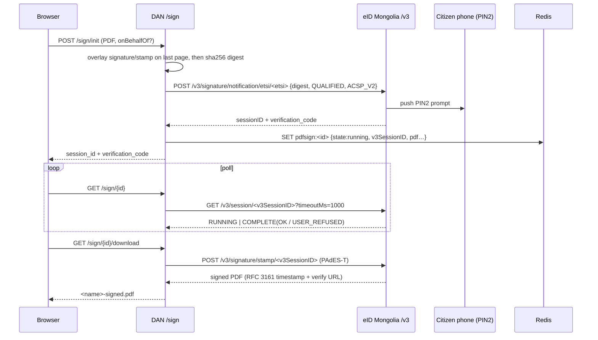

# Баримт бичгийн цахим гарын үсэг (PAdES)

**eID Mongolia-ийн `/v3` API**-аар дамжуулан серверийн талд PDF-д гарын үсэг зурах.
`business/usecases/sign/sign_usecase.go`-д хэрэгжүүлсэн; HTTP гадаргуу нь
`handlers/v1/sign/sign_handler.go` + `routes/route_sign.go`. Session-ийн төлөв нь
DB хүснэгт биш **Redis**-д хадгалагдана.

## Эндпойнтууд

Бүгд `/api/v1/sign` дор холбогдсон, `authMiddleware` шаардана:

| Method | Path | Зорилго |
|--------|------|---------|
| POST | `/sign/init` | multipart (`file` PDF ≤25 MB; заавал биш `onBehalfOf = NTRMN-<orgReg>`) → `session_id` + `verification_code` |
| GET | `/sign/{id}` | төлөв асуух (`running \| completed \| failed \| rejected`) |
| GET | `/sign/{id}/download` | гарын үсэг зурсан PDF-ийг дамжуулах |

## Гарын үсэг зурах урсгал

**Init.** Дүрслэлийн зурагнуудыг (хувийн гарын үсгийн зураг; байгууллагын өмнөөс
гарын үсэг зурах үед байгууллагын тамга) hash хийхээс *өмнө* pdfcpu watermark-аар
дамжуулан **сүүлийн хуудсанд** давхарлана — ингэснээр дүрслэл нь гарын үсэг зурсан
агуулгын хэсэг болно (боломжийн хэрээр; алдаа гарвал алгасна). Asset зургуудыг
**SSRF-ээс хамгаалагдсан** client-ээр татдаг: зөвхөн HTTPS, dial үед хувийн/loopback/
link-local IP-г хориглодог (DNS rebinding-ийн эсрэг бодит алсын IP-г дахин шалгадаг),
redirect-ээс татгалздаг. PDF-ийг `sha256`-аар hash хийж, base64-ээр кодлон, eID руу
`POST /v3/signature/notification/etsi/<etsi>` -аар `certificateLevel:"QUALIFIED"`,
`signatureProtocol:"ACSP_V2"` -тэй илгээнэ — энэ нь **иргэний утас руу PIN2 хүсэлт**
илгээдэг; тэдний зөвшөөрөл нь хууль ёсны консент болно.

**Poll.** Эзэмшлийг шалгасан (IDOR хамгаалалт). `endResult=OK` дээр → `completed`
(гарын үсэг зурагчийн нэр/серийн дугаарыг хадгална); `USER_REFUSED` → `rejected`;
түр зуурын алдаа `running` буцаана. Гэрчилгээний серийн дугаарын хөндлөн шалгалт нь
**блоклодоггүй** (зөвхөн анхааруулга бичдэг), учир нь зарим eID гэрчилгээний серийн
дугаарын формат нь регистрийн дугаарын оронг орхигдуулдаг — итгэлцэл нь `/v3`
session-ийн холбоос дээр тогтдог.

**Download.** Эзэмшлийг шалгасан; `completed` шаардана. Хоёр зам:

- **Үндсэн — eID албан ёсны тамга** (`stampV3`): `POST
  /v3/signature/stamp/<v3SessionID>` нь **PAdES-T** PDF (RFC 3161 timestamp +
  `eidmongolia.mn/verify/<sessionID>` хуудас) буцаана.
- **Нөөц — серверийн өөрөө шигтгэх** (`embedPAdES`): хэрэв stamp дуудлага бүтэлгүйтвэл,
  сервер PDF-д өөрийн байнгын **Document-Signer** гэрчилгээгээр `digitorus/pdfsign`-аар
  (`CertificationSignature`, SHA-256) гарын үсэг зурна. Шалтгааны тэмдэглэлд регистрийн
  дугаарыг, өмнөөс зурах тохиолдолд **eID-ээр баталгаажсан** байгууллагын нэрийг
  дурддаг (хэзээ ч клиентээс өгсөн нэрийг биш).

Гаралтын файлын нэр `<original>-signed.pdf`, кирилл нэрсэд зориулан RFC 5987/6266
`filename*` кодлолтой.

## Байнгын Document-Signer гэрчилгээ

Серверийн Document-Signer нь өөрөө шигтгэх нөөц зам дээр ашиглагддаг тогтмол ECDSA
гэрчилгээ+түлхүүр бөгөөд `SIGN_SIGNER_CERT_FILE` / `SIGN_SIGNER_KEY_FILE`-ээс
ачаалагдана (хоёулаа эсвэл аль нь ч биш). Гарын үсэг давтагдах / баталгаажих /
хүчингүй болгох боломжтой байхын тулд эдгээр нь **restart/replica бүрд ижил байх**
ёстой.

!!! danger "Production-д fail-closed"
    Хэрэв PEM материал байхгүй бөгөөд орчин нь `production` бол usecase нь
    **эхлэхээс татгалздаг** — түр зуурын self-signed түлхүүрүүд давтагдах болон
    хүчингүй болгох боломжгүй. Development-д self-signed P-256 гэрчилгээ үүсгэдэг.

`/v3` руу RP auth нь тохируулагдсан үед `Authorization: Bearer <EID_RP_SECRET>`
нэмдэг. RP identity нь `EID_RP_UUID`, `EID_RP_NAME`, `EID_BASE_URL`-ээс ирдэг.

## Өмнөөс (байгууллагын) гарын үсэг зурах

`onBehalfOf = NTRMN-<orgReg>` дамжуулагдсан үед гарын үсэг нь **иргэний өөрийн PIN2
гэрчилгээгээр** зурагдсан хэвээр байх боловч `onBehalfOf` нь `/v3` хүсэлтэд нэмэгдэж,
eID Mongolia нь иргэний төлөөлөх эрхийг шалгадаг. Хэрэв иргэн төлөөлөх эрхгүй бол
(эсвэл RP нь SIGN scope-гүй бол), `/v3` нь **403** буцаана, энэ нь `apperror.Forbidden`
болон илэрхийлэгдэнэ (5xx болгон нуугддаггүй). Дуусахад eID-ээр баталгаажсан
`onBehalfOf.orgName` нь нөөц шигтгэлийн шалтгааны тэмдэглэлд ашиглагдана.

## Гуравдагч этгээдийн RP-д зориулсан Sign-relay

`internal/provider/signrelay/signrelay.go` нь гуравдагч этгээдийн RP-д (жишээ нь
`template.dgov.mn`) **DAN-ийн** eID credential-аар дамжуулан гарын үсэг зурах
боломжийг олгодог reverse proxy юм — ийм RP-ууд өөрсдийн eID *гарын үсгийн* RP
credential-гүй.

- `SIGN_RELAY_TOKEN` болон `EID_RP_SECRET` хоёул тохируулагдсан үед л `/rp/sign/*`-д
  холбогдоно.
- Proxy нь `/rp/sign/v3/...` → `/v3/...` руу дахин бичиж, eID рүү чиглүүлж,
  **дуудагчийн Authorization-ийг `Bearer <EID_RP_SECRET>`-ээр орлуулна** — энэ нь
  DAN-ийн бодит eID нууц бөгөөд DAN-аас хэзээ ч гардаггүй. Ирж буй RP-ууд зөвхөн
  relay-ийн `SIGN_RELAY_TOKEN`-оор баталгаажна (тогтмол хугацаагаар харьцуулсан;
  таарахгүй бол 401).

Гуравдагч этгээдийн RP нь өөрийн `EID_BASE_URL`-ийг DAN-ийн RP UUID-тай
`https://sso.dgov.mn/rp/sign/v3` руу тохируулна.
