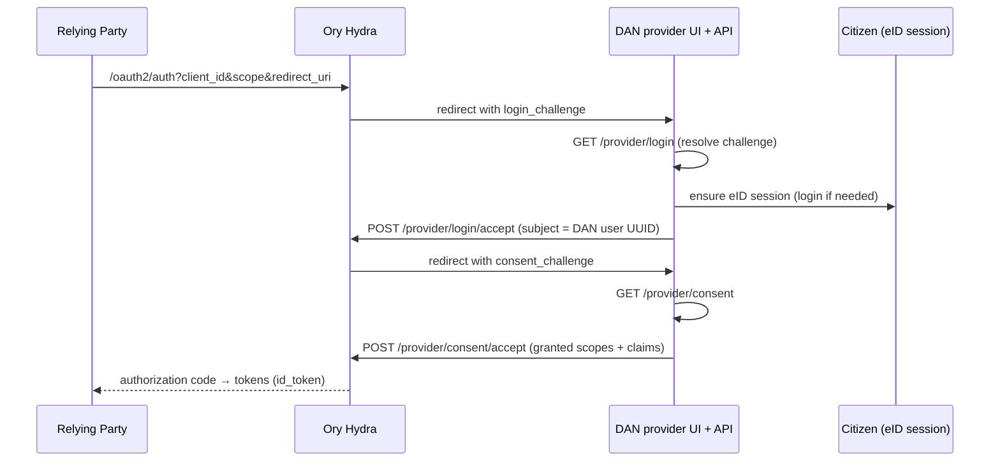

# Sign in with DAN (OIDC provider)

The platform can act as an OIDC **provider** with **Ory Hydra** in front, so
relying parties (RPs) can offer a *"Sign in with DAN"* button. Usecase:
`business/usecases/provider/provider.go`.

Hydra owns `/oauth2/auth` and redirects the browser to DAN's login/consent/logout
pages with a challenge. The provider usecase resolves the challenge against
Hydra's admin API and authenticates the citizen using DAN's **existing eID
session** — no separate credential.

## When it's enabled

Only when `config.ProviderConfigured()` is true — requires `HYDRA_ADMIN_URL`,
`HYDRA_PUBLIC_URL`, and `len(SSOStateKey) >= 32`. The provider routes and the
OAuth-client management surface are registered conditionally. The Hydra **admin**
URL (default `http://hydra:4445`) must never be publicly exposed. First-party
client IDs that skip the consent UI come from `SSO_FIRSTPARTY_CLIENTS`.

## Endpoints

Mounted at `/api/v1/provider`, 4 KiB body cap. `get` / `reject` /
`logout-accept` are challenge-authenticated (no bearer); the two `accept`
endpoints require a logged-in citizen.

| Endpoint | Auth | Method |
|----------|------|--------|
| `GET /provider/login?login_challenge=…` | challenge | `GetLogin` |
| `GET /provider/consent?consent_challenge=…` | challenge | `GetConsent` |
| `POST /provider/login/reject` | challenge | `RejectLogin` |
| `POST /provider/consent/reject` | challenge | `RejectConsent` |
| `POST /provider/logout/accept` | challenge | `AcceptLogout` |
| `POST /provider/login/accept` | 🔒 logged-in | `AcceptLogin` |
| `POST /provider/consent/accept` | 🔒 logged-in | `AcceptConsent` |

## Login, consent, logout

**Login.** `AcceptLogin` sets the Hydra **subject = the DAN user UUID** (a
stable, opaque per-citizen id), with `Remember` / `RememberFor=3600 s` and
`ACR="eid"`, `AMR=["eid"]`.

**Consent.** The consent UI is skipped for first-party clients or when Hydra sets
`Skip`. On accept it enforces `req.Subject == userID` (you cannot consent on
another citizen's behalf), clamps granted scope to requested, then fail-closed
loads the user and builds claims. `claimsForScopes` maps scopes → id_token claims:

| Scope | Claims |
|-------|--------|
| `profile` | `name`, `given_name`, `family_name` (+ `_en` variants) |
| `email` | `email`, `email_verified` |
| `nationalid` | `national_id`, `register_number` (civil_id) |
| `google` | `google_sub` / `google_email` / `google_name` / `google_picture` — **only** if requested and the citizen linked Google (data minimization) |

`sub` is deliberately **not** set here — it comes from the Hydra login subject.
Consent is remembered for 30 days.

**Logout.** `AcceptLogout` forwards to `hydra.AcceptLogout`. On the client side,
an SSO-initiated logout URL (with `id_token_hint`) is stored in the
`dgov_sso_logout` cookie.

## Registering relying parties

The `/api/v1/applications` management surface (also Hydra-gated) registers OAuth2
clients: `web` (confidential), `spa` / `native` (public + PKCE). See the
[API Reference](../api/index.md#applications-oauth2-clients).
