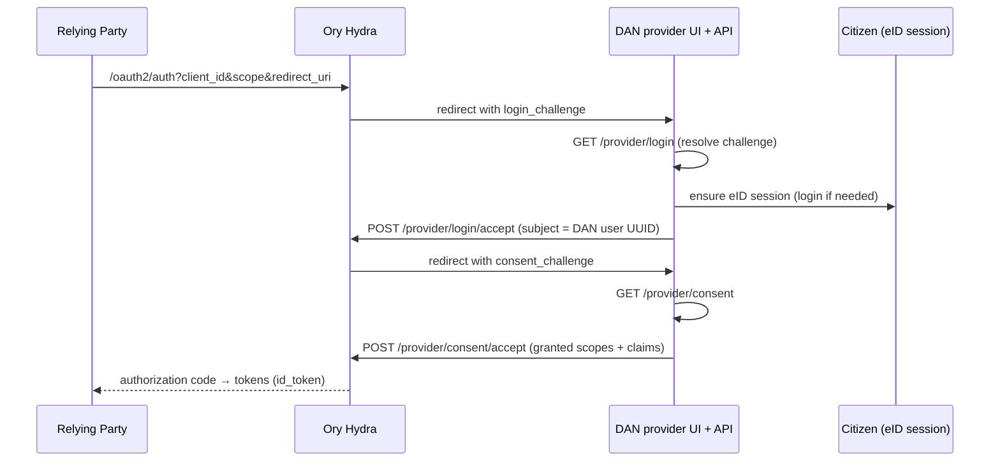

# Sign in with DAN (OIDC provider)

Платформ нь урд талдаа **Ory Hydra** бүхий OIDC **provider** болж ажиллаж
чаддаг тул итгэмжлэгдсэн талууд (RP-ууд) *"Sign in with DAN"* товч санал болгож
чадна. Usecase: `business/usecases/provider/provider.go`.

Hydra нь `/oauth2/auth`-г эзэмшдэг ба браузерыг DAN-ы login/consent/logout
хуудсууд руу challenge-тай хамт чиглүүлдэг. Provider usecase нь challenge-г
Hydra-гийн admin API-тай тулган шийдэж, иргэнийг DAN-ы **одоо байгаа eID
session**-ээр баталгаажуулна — тусдаа credential шаардахгүй.

## Хэзээ идэвхтэй байх

Зөвхөн `config.ProviderConfigured()` нь true үед — `HYDRA_ADMIN_URL`,
`HYDRA_PUBLIC_URL`, болон `len(SSOStateKey) >= 32`-г шаарддаг. Provider route-ууд
болон OAuth-client удирдлагын гадаргууг нөхцөлт байдлаар бүртгэдэг. Hydra-гийн
**admin** URL (өгөгдмөл `http://hydra:4445`)-г хэзээ ч нийтэд ил гаргаж болохгүй.
Consent UI-г алгасдаг эхний талын client ID-ууд нь `SSO_FIRSTPARTY_CLIENTS`-ээс
ирдэг.

## Endpoint-ууд

`/api/v1/provider` дор холбогдсон, 4 KiB биеийн хязгаартай. `get` / `reject` /
`logout-accept` нь challenge-ээр баталгаажсан (bearer байхгүй); хоёр `accept`
endpoint нь нэвтэрсэн иргэнийг шаарддаг.

| Endpoint | Auth | Method |
|----------|------|--------|
| `GET /provider/login?login_challenge=…` | challenge | `GetLogin` |
| `GET /provider/consent?consent_challenge=…` | challenge | `GetConsent` |
| `POST /provider/login/reject` | challenge | `RejectLogin` |
| `POST /provider/consent/reject` | challenge | `RejectConsent` |
| `POST /provider/logout/accept` | challenge | `AcceptLogout` |
| `POST /provider/login/accept` | 🔒 logged-in | `AcceptLogin` |
| `POST /provider/consent/accept` | 🔒 logged-in | `AcceptConsent` |

## Нэвтрэх, зөвшөөрөх, гарах

**Нэвтрэх.** `AcceptLogin` нь Hydra-гийн **subject = DAN хэрэглэгчийн UUID**
(тогтвортой, иргэн тус бүрийн бүрхэг id) болгож тохируулна, `Remember` /
`RememberFor=3600 s` болон `ACR="eid"`, `AMR=["eid"]`-тай.

**Зөвшөөрөх.** Consent UI-г эхний талын client-уудын хувьд эсвэл Hydra `Skip`
тохируулсан үед алгасна. Хүлээн авах үед `req.Subject == userID`-г мөрдүүлнэ
(та өөр иргэний өмнөөс зөвшөөрч чадахгүй), олгосон scope-г хүссэн scope хүртэл
хязгаарлаж, дараа нь fail-closed байдлаар хэрэглэгчийг ачаалж claim-уудыг
бүрдүүлнэ. `claimsForScopes` нь scope-уудыг → id_token claim-уудтай хослуулна:

| Scope | Claim-ууд |
|-------|--------|
| `profile` | `name`, `given_name`, `family_name` (+ `_en` хувилбарууд) |
| `email` | `email`, `email_verified` |
| `nationalid` | `national_id`, `register_number` (civil_id) |
| `google` | `google_sub` / `google_email` / `google_name` / `google_picture` — **зөвхөн** хүссэн бөгөөд иргэн Google холбосон тохиолдолд (өгөгдлийн хамгийн бага зарчим) |

`sub`-г энд зориудаар тохируулдаг**гүй** — энэ нь Hydra-гийн login subject-ээс
ирдэг. Consent-г 30 хоног санана.

**Гарах.** `AcceptLogout` нь `hydra.AcceptLogout` руу дамжуулна. Клиент талд
SSO-оос эхэлсэн гарах URL-г (`id_token_hint`-тэй) `dgov_sso_logout` cookie-д
хадгална.

## Итгэмжлэгдсэн талуудыг бүртгэх

`/api/v1/applications` удирдлагын гадаргуу (мөн Hydra-хаалттай) нь OAuth2
client-уудыг бүртгэдэг: `web` (нууц), `spa` / `native` (нээлттэй + PKCE). [API
Reference](../api/index.md#applications-oauth2-clients)-г үзнэ үү.
